# MealCraft

Angular 21 recipe app: TheMealDB + local recipes + auth roles + feedback.

## Start

```bash
npm ci
npm run start
```

Open `http://localhost:4200/`.

## Scripts

- `npm run build` – production build
- `npm run test:ci` – tests (CI mode)
- `npm run test:ci:coverage` – tests + coverage
- `npm run lint` – ESLint
- `npm run typecheck` – TypeScript static analysis
- `npm run analyze:knip` – dead code / dependency analysis
- `npm run graph:dependencies` – dependency + component graph source files
- `npm run graph:render` – render Mermaid graphs to SVG/PNG
- `npm run readme:update` – refresh auto-docs section in README

## CI/CD

- Pipeline: `.github/workflows/pipeline.yml`
- Stages: build, lint, typecheck, audit, knip, tests, coverage, docs sync, deploy

## Dev admin

- Email: `admin@admin.pl`
- Password: `admin@admin.pl`

<!-- AUTO-DOCS:START -->
## Automated Architecture Docs

This section is auto-generated by CI during each `main` deployment pipeline run.

### Component Tree (Rooted at app.ts)



PNG fallback: [component-tree.png](reports/dependency-graph/component-tree.png)

### Artifacts

- [Graph summary](reports/dependency-graph/summary.md)
- [Component tree (Mermaid)](reports/dependency-graph/component-tree.mmd)
- [Component graph (Mermaid)](reports/dependency-graph/component-graph.mmd)
- [Module graph (Mermaid)](reports/dependency-graph/graph.mmd)
- [Component tree (SVG)](reports/dependency-graph/component-tree.svg)
- [Component graph (SVG)](reports/dependency-graph/component-graph.svg)

### Coverage Report

_Coverage summary not found in workspace. Run `npm run test:ci:coverage` first._

### Test Status

| Test | Status |
|---|---:|
| Unit tests (`npm run test:ci`) | ❓ UNKNOWN |
| Coverage tests (`npm run test:ci:coverage`) | ❌ FAIL |
| Coverage threshold gate (Lines >= 70%) | ❓ UNKNOWN |
<!-- AUTO-DOCS:END -->
