# MealCraft

MealCraft is an Angular 21 recipe app that combines TheMealDB data with local recipes, feedback (votes/tags), and role-based settings.

## Core features

- Unified recipe list: API + local + optional dummy data.
- Filtering and sorting: search, cuisine, category, tags, mine-only.
- Local recipe lifecycle: add, edit, delete (owner-aware permissions).
- Authentication and roles: `user` / `admin`.
- Admin tools: data reset, diagnostics, quality pipeline.

## Quick start

```bash
npm ci
npm run start
```

Open `http://localhost:4200/`.

## Useful scripts

- `npm run build` – production build
- `npm run test:ci` – tests (CI mode)
- `npm run test:ci:coverage` – tests + coverage
- `npm run lint` – ESLint
- `npm run typecheck` – TypeScript static analysis
- `npm run analyze:knip` – dead code / dependency analysis
- `npm run graph:dependencies` – dependency + component graph source files
- `npm run graph:render` – render Mermaid graphs to SVG/PNG
- `npm run readme:update` – refresh auto-docs section in README

## CI/CD

Unified pipeline lives in `.github/workflows/pipeline.yml` and includes:

- build, lint, typecheck, security audit
- knip, architecture graph, bundle size check
- tests + coverage report
- auto docs/chart sync on push to `main`
- GitHub Pages deployment

## Default admin account (dev)

- Email: `admin@admin.pl`
- Password: `admin@admin.pl`

<!-- AUTO-DOCS:START -->
## Automated Architecture Docs

This section is auto-generated by CI on every push to `main`.

### Component Dependency Chart



PNG fallback: [component-graph.png](reports/dependency-graph/component-graph.png)

### Dependency Graph Artifacts

- [Graph summary](reports/dependency-graph/summary.md)
- [Module graph (Mermaid)](reports/dependency-graph/graph.mmd)
- [Component graph (Mermaid)](reports/dependency-graph/component-graph.mmd)
- [Module graph (SVG)](reports/dependency-graph/graph.svg)

### CI Quality Steps

- Build
- Lint
- Typecheck (static analysis)
- Security audit
- Dead code analysis (knip)
- Architecture graph generation
- Bundle size check
- Tests + coverage report
- GitHub Pages deploy

### Coverage Report

_Coverage summary not found in workspace. Run `npm run test:ci:coverage` first._

### Test Status

| Test | Status |
|---|---:|
| Unit tests (`npm run test:ci`) | ❓ UNKNOWN |
| Coverage tests (`npm run test:ci:coverage`) | ❌ FAIL |
| Coverage threshold gate (Lines >= 70%) | ❓ UNKNOWN |
<!-- AUTO-DOCS:END -->
